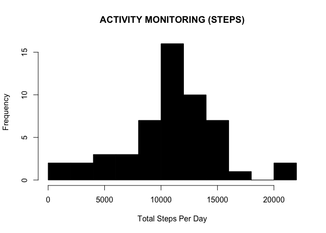
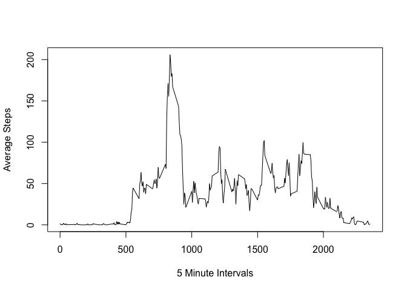
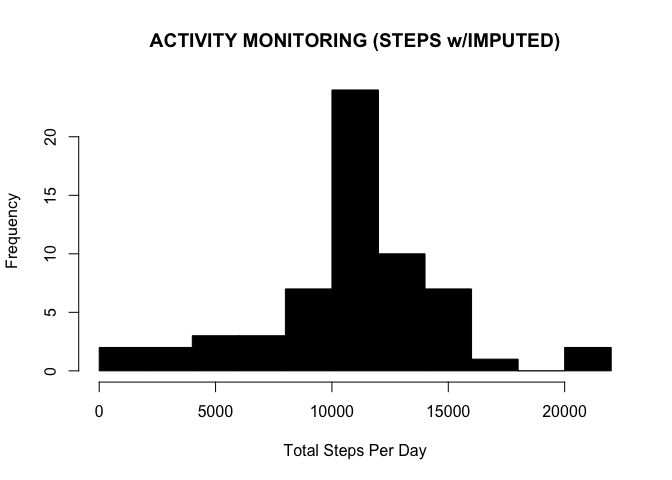
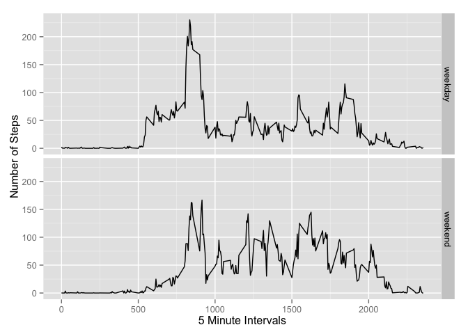

# Reproducible Research: Peer Assessment 1
Jesse Shaw  
March 15, 2015  


## Loading and preprocessing the data
>Show any code that is needed to

 1. Load the data (i.e. read.csv())
 2. Process/transform the data (if necessary) into a format suitable for your analysis


```r
##STEP 1 - Reproducible Research Peer Review 1
##This script will download the activity file required for Peer Review 1

##Set File URL
fileURL <- "https://d396qusza40orc.cloudfront.net/repdata%2Fdata%2Factivity.zip"

##Make Temporary Folder
tempFolder = tempdir()

##Prototype File
protoFile = tempfile(tmpdir=tempFolder, fileext=".zip")

##Download File OSX
download.file(fileURL, protoFile, method="curl")
#download.file(fileURL, protoFile) #Windows

##Pull Filename
pulledName = unzip(protoFile, list=TRUE)$Name[1]

#Unzip File To Temporary Folder -Overwrite To Prevent Errors 
unzip(protoFile, files=pulledName, exdir=tempFolder, overwrite=TRUE)

##Set Path To Activity File
filePath = file.path(tempFolder, pulledName)

##Load Text File To Dataframe
df <- read.csv(filePath, as.is=TRUE)
```

A portion of the original dataset is as follows:

```
##   steps       date interval
## 1    NA 2012-10-01        0
## 2    NA 2012-10-01        5
## 3    NA 2012-10-01       10
## 4    NA 2012-10-01       15
## 5    NA 2012-10-01       20
```

## What is mean total number of steps taken per day?
>For this part of the assignment, you can ignore the missing values in the dataset.

 1. Make a histogram of the total number of steps taken each day
 2. Calculate and report the mean and median total number of steps taken per day


```r
##STEP 2 - Reproducible Research Peer Review 1
##This script will explore the activity data by generating a histogram of 
##complete cases and calculate base statistics.

##Remove NAs from df in Step 1
df_no_NA <- na.omit(df)

##Aggregate Total Steps Per Day
df_steps_per_day <- aggregate(steps ~ date, df_no_NA, sum)

#Create Histogram
hist(df_steps_per_day$steps, 
     col=1, 
     main="ACTIVITY MONITORING (STEPS)",
     breaks=10,
     xlab="Total Steps Per Day")
```

 

```r
#Calculate Mean And Median Steps Per Day
ave_steps <- mean(df_steps_per_day$steps)
median_steps <- median(df_steps_per_day$steps)
```

Mean:

```
## [1] 10766.19
```
Median:

```
## [1] 10765
```


## What is the average daily activity pattern?
>What is the average daily activity pattern?

 1. Make a time series plot (i.e. type = "l") of the 5-minute interval (x-axis) and the average number of steps taken, averaged across all days (y-axis)
 2. Which 5-minute interval, on average across all the days in the dataset, contains the maximum number of steps?


```r
##STEP 3 - Reproducible Research Peer Review 1
##This script will reduce data to days and generate an average 5 minute interval for all days
##df_no_NA is used from Step2 which has NAs ommitted

#Aggregate Average Steps And Calculate Mean
df_mean_steps <- aggregate(steps ~ interval, df_no_NA, mean)

#Generate Line Plot
plot(df_mean_steps$interval, 
     df_mean_steps$steps, 
     type='l', 
     col=1, 
     main="", 
     xlab="5 Minute Intervals", 
     ylab="Average Steps")
```

 

```r
##Observation With The Maximum Number Of Steps
max_steps <- df_mean_steps [which.max(df_mean_steps$steps), ]
```

Interval with MAX steps:

```
##     interval    steps
## 104      835 206.1698
```

## Imputing missing values
>Note that there are a number of days/intervals where there are missing values (coded as NA). The presence of missing days may introduce bias into some calculations or summaries of the data.

 1. Calculate and report the total number of missing values in the dataset (i.e. the total number of rows with NAs)
 2. Devise a strategy for filling in all of the missing values in the dataset. The strategy does not need to be sophisticated. For example, you could use the mean/median for that day, or the mean for that 5-minute interval, etc.
 3. Create a new dataset that is equal to the original dataset but with the missing data filled in.
 4. Make a histogram of the total number of steps taken each day and Calculate and report the mean and median total number of steps taken per day. Do these values differ from the estimates from the first part of the assignment? What is the impact of imputing missing data on the estimates of the total daily number of steps?


```r
##STEP 4 - Reproducible Research Peer Review 1
##This script will count the number of NA observations and then replace NAs with approximated values 
##by creating a function to impute them

##Subset NAs From df
df_NAs <- is.na(df$steps)

##Calculate The Number Of Missing Values
NA_values <- sum(df_NAs)
```

Number of missing values (NAs):

```
## [1] 2304
```


```r
##STEP 4 - Reproducible Research Peer Review 1 (Continued...)
##Impute NAs Function
imputeNA <- function(steps, interval){
        imputed <- NA
        if (!is.na(steps))
                imputed <- c(steps)
        else
                imputed <- (df_mean_steps[df_mean_steps$interval==interval, "steps"])
        return(imputed)
}

##Copy df To df_imputed
df_imputed <- df

##Mapply imputeNA Function
df_imputed$steps <- mapply(imputeNA, df_imputed$steps, df_imputed$interval)

##Aggregate Total Steps Per Day
df_steps_per_day_imputed <- aggregate(steps ~ date, df_imputed, sum)

##Create Histogram
hist(df_steps_per_day_imputed$steps, 
     col=1, 
     main="ACTIVITY MONITORING (STEPS w/IMPUTED)",
     breaks=10,
     xlab="Total Steps Per Day")
```

 

```r
#Calculate Mean And Median Steps Per Day
ave_steps_imputed <- mean(df_steps_per_day_imputed$steps)
median_steps_imputed <- median(df_steps_per_day_imputed$steps)
```

New mean with imputed values:

```
## [1] 10766.19
```

New median with imputed values:

```
## [1] 10766.19
```

The imputed mean does not vary while median values only vary slightly since a 5 minute interval average was used to replace NA values.

Mean: 10766 to 10766

Median: 10765 to 10766


## Are there differences in activity patterns between weekdays and weekends?
>For this part the weekdays() function may be of some help here. Use the dataset with the filled-in missing values for this part.

 1. Create a new factor variable in the dataset with two levels - "weekday" and "weekend" indicating whether a given date is a weekday or weekend day.
 2. Make a panel plot containing a time series plot (i.e. type = "l") of the 5-minute interval (x-axis) and the average number of steps taken, averaged across all weekday days or weekend days (y-axis). The plot should look something like the following, which was creating using simulated data:


```r
##STEP 5 - Reproducible Research Peer Review 1
##This script will compare activity between weekdays and weekends using df_imputed from Step4

##Load GGPlot2
library(ggplot2)

##Weekday Identification Function
type_day <- function(date){
        day_type <- weekdays(date)
        if (day_type %in% c("Monday", "Tuesday", "Wednesday", "Thursday", "Friday"))
                return("weekday")
        else if (day_type %in% c("Saturday", "Sunday"))
                return("weekend")
        else
                stop("Bad Date Format")
}

##Convert Activity Date to Type DATE
df_imputed$date <- as.Date(df_imputed$date)

##Add Day Field Via type_day Function
df_imputed$day_type <- sapply(df_imputed$date, FUN = type_day)

##Aggregate Steps Per Day
df_steps_per_day_type_imputed <- aggregate(steps ~ interval+day_type, df_imputed, mean)

#Weekday And Weekend Panel Plot
step_panel <- ggplot(df_steps_per_day_type_imputed, aes(interval, steps))+geom_line()+ facet_grid(day_type ~ .) + 
        xlab("5 Minute Intervals") + 
        ylab("Number of Steps")

print(step_panel)
```

 

From the graphs, it appears as though people move around more on the weekends.
